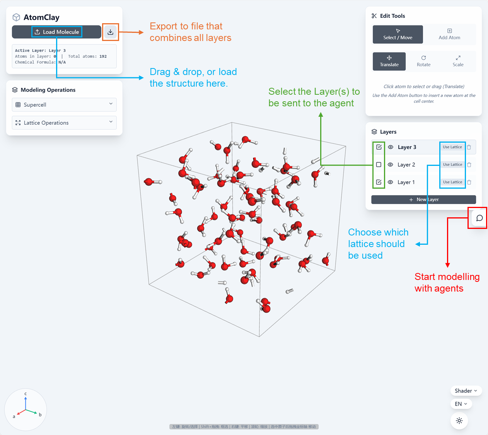

# Vibe Modelling with AtomClay

## Installation guide:

1. Setup the `config.json` in the `./config/` folder. You can leave it as default.
2. Create a `.env` file in the `./config/` folder based on the `example.env` file.
3. Run the `setup.bat` (Windows) or `setup.sh` (Linux/macOS) script to install dependencies for all the packages.
4. After setup, you can run the `python ./start_dev.py` script to start the App.
5. The default server will be running at `http://localhost:5173/`.
6. `Ctrl+C` in the terminal to stop the server.

## Requirements:
- Python 3.8+
- Node.js from `https://nodejs.org/en`
